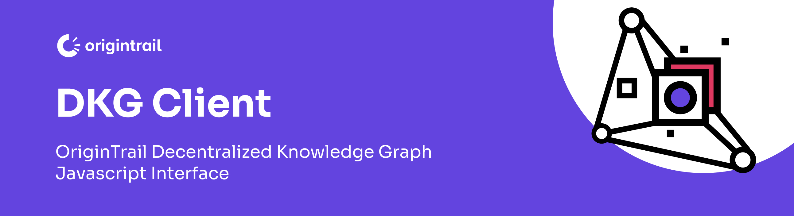

# DKG.js

**Javascript library for interaction with the OriginTrail Decentralized Knowledge Graph**

**Note**: This library is currently in beta, so you can expect issues to arise. We'd appreciate that if you do run into trouble, you [open up an issue on this repository](https://github.com/OriginTrail/dkg.js/issues) and let us know. 
Also, there are two actively maintained versions, v5 and v6, make sure you are using the appropriate one.
The official OriginTrail documentation for v6 can be found [here](https://docs.origintrail.io/dkg-v6-upcoming-version/introduction-to-dkg-v6-start-here).


## Intro - What is a Decentralized Knowledge Graph (DKG)


There are many avaialable definitions of a knowlege graph, therefore we will present a simplified one focused on usability, rather than completeness. The purpose of this introduction is not to be a comprehensive guide for knowledge graphs, however it aims to get you started with the basics.

A **knowledge graph (KG)** is a network of entities — physical & digital objects, events or concepts — illustrating the relationship between them (aka a semantic network). KGs are used by major companies such as [Amazon](http://lunadong.com/talks/PG.pdf), [Google](https://en.wikipedia.org/wiki/Google_Knowledge_Graph), [Uber](https://www.youtube.com/watch?v=r3yMSl5NB_Q), [IBM](https://www.ibm.com/cloud/learn/knowledge-graph) etc for various applications: search, data integration, knowledge reasoning, recommendation engines, analytics, machine learning and AI etc.

Key characteristics of knowledge graphs:
* focus on data connections as "first class citizens" (linked data) 
* designed to ingest data from multiple sources, usually in different formats
* flexible data model, easily extendable

Common knowledge graphs however are deployed within the domain of one organization and are designed to capture knowledge from various sources both from within and outside of the organization.

We define **decentralized knowledge graph (DKG)** as a global shared knowledge graph that is designed to benefit organizations and individuals by providing a common infrastructure for data exchange. The DKG:

* Enables Dapps with search, integration, analytics, AI and ML capabilities for any data source: blockchains, IPFS, enterprise systems, web services, personal devices 
* Removes central authorities (decentralized infrastructure)
* Enables permissionless PUBLISH and QUERY (public network)
* Decentralized identity & Verifiable Credentials based access control (references private data)

## The OriginTrail DKG Architecture 

The OriginTrail Decentralized Network implements the DKG according the the OriginTrail protocol.

It is:

* **a permissionless network** - anyone can run OriginTrail nodes
* **a multi-chain data exchange network** - connects to several blockchains (currently Ethereum and xDai with more integrations upcoming such as with Polkadot)
* **designed for off-chain data exchange using standardized data models** (GS1 & W3C standards and recommendations)
* **public open source software**
* **infrastructure for knowledge marketplaces & tenders** - more info [here](https://www.youtube.com/watch?v=4uCxYGRh5fk)

More information is available on the OriginTrail [website](https://origintrail.io), [official documentation](https://docs.origintrail.io) and [blog](https://medium.com/origintrail).


## DKG Client library

This library provides an interface into the OriginTrail Decentralized Knowledge Graph, enabling:

* provisioning & updating assets on the public DKG
* network and local querying of information based on topics and identifiers
* verifying the integrity of queried data

### Instalation

Run:
```sh
npm install dkg.js
```

Include:
```javascript
<script src="https://cdn.jsdelivr.net/npm/web3@latest/dist/web3.min.js"></script>
<script src="./node_modules/dist/index.bundle.js"></script>
```

### Setting up your development environment

The easiest way to jumpstart development in a local environment is to [set up OT-node v6 in local environment or connect it to public beta DKG](https://docs.origintrail.io/dkg-v6-upcoming-version/setup-instructions-dockerless).

### Getting started

```html
<!DOCTYPE html>
<html>
<head>
    <script src="https://cdn.jsdelivr.net/npm/web3@latest/dist/web3.min.js"></script>
    <script src="./dist/index.bundle.js"></script>
    <script>
        window.addEventListener('load', async function () {

            const OT_NODE_HOSTNAME = 'alpha-stella-node-06.origin-trail.network';
            const OT_NODE_PORT = '8900';
            let options = { endpoint: OT_NODE_HOSTNAME, port: OT_NODE_PORT, useSSL: true, loglevel: 'trace' };
            
            this.dkg = new SemanticWeb3(options);

            this.dkg.nodeInfo().then(result => {
                console.log(JSON.stringify(result, null, 2));
            });

            // Create and update an assertion
            options = {
                keywords: ['ETHDenver'],
                visibility: 'public'
            };

            const content = {
                "@context": "https://www.schema.org/",
                "@type": "ERC721",
                "asset_data": {
                    "properties": {
                        "prop1": "value1",
                        "prop2": {
                            "abc":"ads",
                            "abs":"adsb"
                        },
                    },

                    "urls": "https://opensea.io/assets/0xbc4ca0eda7647a8ab7c2061c2e118a18a936f13d/8520"

                },
                "native_blockchain": "polygon",
                "onchain_data": {
                    "contract_address": "0x123",
                    "tokenID": "32",
                    "tokenURI": "....",
                    "owner": "0x12345431",
                    "name": "Tracie 101 Updated",
                    "symbol": "TRACIE",
                    "eventHistory": [{
                        "timestamp": "2020-10-12",
                        "from": "0x123",
                        "to": "0x343",
                        "event": "Transfer",
                    },
                        {
                            "timestamp": "2020-09-11",
                            "from": "0x123",
                            "to": "0x343",
                            "event": "Sale",
                            "price": "1.23",
                            "currency": "ETH",
                        }

                    ]
                },
                "erc721_metadata": {
                    "title": "Asset Metadata",
                    "type": "object",
                    "properties": {
                        "name": {
                            "type": "string",
                            "description": "Identifies the asset to which this NFT represents"
                        },
                        "description": {
                            "type": "string",
                            "description": "Describes the asset to which this NFT represents"
                        },
                        "image": {
                            "type": "string",
                            "description": "A URI pointing to a resource with mime type image/* representing the asset to which this NFT represents. Consider making any images at a width between 320 and 1080 pixels and aspect ratio between 1.91:1 and 4:5 inclusive."
                        }
                    }
                },
                "linkedTo": [
                    "ual1",
                    "ual2",
                ]
            }
            
            let result = await dkg.assets.create(content,options)
            let ual = result.data.metadata.UALs[0];
            console.log(`Created UAL is ${ual}`)

            // Get an asset
            let asset = await dkg.assets.get(ual);

            const proof = await asset.data.proof.valueOf;
            console.log(`Proof is ${JSON.stringify(proof)}}`)

            // Search for assertions by using a keyword
            options = { query: 'ETHDenver', resultType: 'assertions' }; //or entities
            await dkg.search(options).then((result) => {
                console.log(JSON.stringify(result, null, 2));
            });

            // Run sparql queries

            // Retrieve all connected UALs for a given UAL
            ual = 'a44c97e1a27eab0db298f01f1a5d7c9d84caed8c7ce91480acaf92989888fc37';
            options = {
                query: `PREFIX schema: <http://schema.org/>
                        construct { ?b2 schema:linkedTo ?linkedAssets }
                        WHERE {
                            GRAPH ?g {
                                ?b1 schema:linkedTo ?linkedAssets .
                            }
                            ?b2 schema:hasUALs '${ual}'
                            FILTER (?g = ?b2)
                        }`
            };

            dkg.query(options).then((result) => {
                console.log(JSON.stringify(result, null, 2));
            });
            
            // Get all states for an asset
            ual = 'a44c97e1a27eab0db298f01f1a5d7c9d84caed8c7ce91480acaf92989888fc37';
            options = {
                query: `PREFIX schema: <http://schema.org/>
                        construct { ?assertionId schema:hasUALs ?assertionId }
                        WHERE {
                            ?assertionId schema:hasUALs '${ual}' .
                        }`
            };

            dkg.query(options).then((result) => {
                console.log(JSON.stringify(result, null, 2));
            });
        });
    </script>
</head>
<body>

<h1>Traceon!</h1>


</body>
</html>
```

## Learn more

More information can be found on the [official DKGv6 documentation](https://docs.origintrail.io/dkg-v6-upcoming-version/introduction-to-dkg-v6-start-here), [website](https://origintrail.io) and [Github](https://github.com/OriginTrail).

## Get in touch

Get in touch with the OriginTrail tech community through [Discord](https://discordapp.com/invite/FCgYk2S). 

[`#traceon`]()